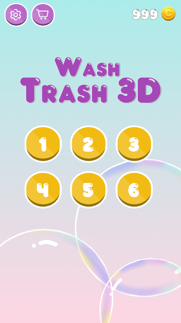
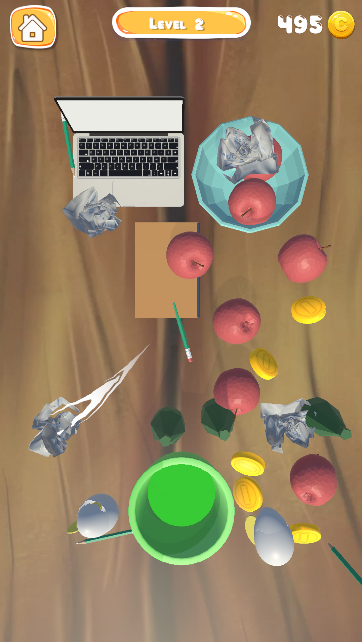
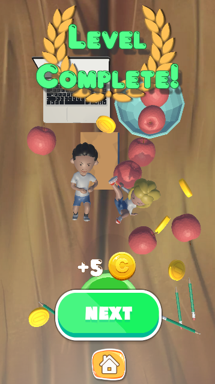

# Wash Trash 3D

Жанры: Sorting, Match, Puzzle

**Скачать:** [Wash Trash 3D](https://disk.yandex.ru/d/qzMiVI6xxstw-w)

  

  
  
  

## Описание:
Игра разработана в рамках курса повышения квалификации "Разработка игр на Unity".
В каждом уровне игроку необходимо очистить игровое поле от мусора, соединяя объекты одинакового типа.
На сцене также присутствуют объекты, не относящиеся к мусору, что усложняет игровой процесс.

## Ключевые особенности:
- Механика соединения объектов одинакового типа
- Обработка взаимодействия игрока с объектами на сцене
- Механика перетаскивания объектов (drag & drop)
- Управление игровым циклом через Finite State Machine

## Использованные технологии и подходы:
- Component-based архитектура
- Event-driven взаимодействие между компонентами (UnityEvents)
- Адаптивный UI (SafeArea, поддержка разных разрешений и вертикальной и горизонтальной ориентаций)
- Finite State Machine для управления игровым циклом (меню, игра, победа)
- Работа со скриптовой анимацией, стандартным Animator, DoTween
- Работа с анимацией 3D-моделей
- Сохранение и загрузка данных (JSON-сериализация)
- Работа с VFX (Particle system, trail)
- Object Pooling для оптимизации VFX
- ScriptableObjects для хранения прогресса игрока
- Работа с  визуальным оформлением объектов

## Возможные улучшения реализации:
- Переработать систему переключения UI (сейчас реализована через Animator)
- Упростить логику переключения игрового состояния (на данный момент реализовано через 2 скрипта на
каждом элементе, переключающем GameState)
- Разделить ответственность Getter (отделить логику подсчета количества мусора и визуального отклика)
- Улучшить настройки сцены (позиции коллайдеров, точка спавна объектов)
- Перейти от статической загрузки уровней (prefab) к процедурной генерации
